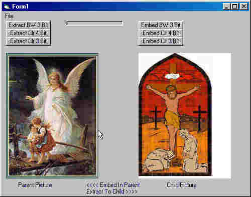



## Picture In Picture Encryption Embedding\!

### Description

Here is another dandy!

This ap will embed or encrypt a

picture within another picture!

It uses 3 and 4 bit encryption.

It clears the lower order bits

on a "Parent" picture and embeds

the higher order bits of a "Child" picture.

There is little or no noticeable differences

between a childless parent picture and

one that has been emdedded with a child picutre,

depending on which option was chosen.

There are three options for embedding.

3 Bit Greyscale, 3 Bit and 4 Bit Color.

On the 3 Bit Greyscale the child picture

is converted to greyscale.

On the 3 Bit and 4 Bit Color the child picture

retains its color.

A full expaination is included in the Form comments.

To use it you should open a "Parent" and a

"Child" picture and choose an embed option.

After this you can save your Parent picture.

You can also extract it again at any time.

Pretty neat little program!

One more thing, the option you select to embed

should be the same one

you use to extract.

Otherwise peculiar pictures will be extracted!

Have Fun! :o)

Happy Valentines Day!

Love suffereth long, and is kind; Love envieth not; Love vaunteth not itself, is not puffed up,

Doth not behave itself unseemly, seeketh not her own, is not easily provoked, thinketh no evil;

Rejoiceth not in iniquity, but rejoiceth in the truth;

Beareth all things, believeth all things, hopeth all things, endureth all things.

Love never faileth: but whether there be prophecies, they shall fail; whether there be tongues, they shall cease; whether there be knowledge, it shall vanish away.

And now abideth faith, hope, Love, these three; but the greatest of these is Love.

I Corinthians 13:4 -8,  13:13

Happy Valentines Day
 
### More Info
 

             |
---                |---
**Submitted On**   |2002-02-14 21:33:36
**By**             |[Jose M\. Lopez](https://github.com/Planet-Source-Code/PSCIndex/blob/master/ByAuthor/jose-m-lopez.md)
**Level**          |Intermediate
**User Rating**    |5.0 (60 globes from 12 users)
**Compatibility**  |VB 6\.0
**Category**       |[Encryption](https://github.com/Planet-Source-Code/PSCIndex/blob/master/ByCategory/encryption__1-48.md)
**World**          |[Visual Basic](https://github.com/Planet-Source-Code/PSCIndex/blob/master/ByWorld/visual-basic.md)
**Archive File**   |[Picture\_In553562142002\.zip](https://github.com/Planet-Source-Code/jose-m-lopez-picture-in-picture-encryption-embedding__1-31816/archive/master.zip)

